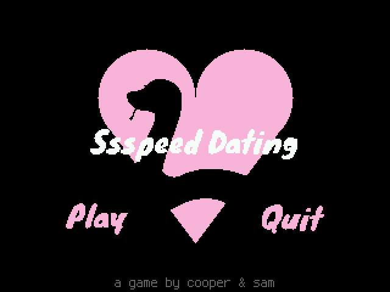
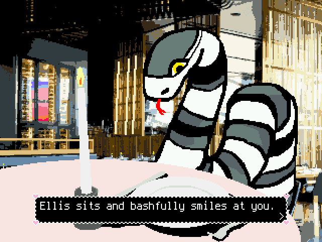

# Fruit_Jam_Ssspeed_Dating
Speed dating sim for snakes written in CircuitPython for the [Adafruit Fruit Jam](https://www.adafruit.com/product/6200).

| Title Screen                                                   | Dialogue Scene                                                                  |
|:--------------------------------------------------------------:|:-------------------------------------------------------------------------------:|
|  |  |

## Controls

Currently, the only method to control this game is with a USB mouse using the on-screen cursor. All actions are completed with a left click. Some events require that an object be hovered over and then clicked while others you can click anywhere on the screen to proceed.

In order to exit while playing the game, click the door icon in the top right corner. This will bring up a confirmation prompt which will return you back to the title screen. At this point, you can reload the device by clicking the "Quit" option on the title screen. If the application is installed within [Fruit Jam OS](https://github.com/adafruit/Fruit-Jam-OS), it will return to the main menu of the operating system.

## Credits

Special thanks to the following contributors of this project:
- Cooper Dalrymple (@relic-se) for programming, artwork, voice acting, music and dialogue
- Sam Earley (@sammwich96) for artwork, voice acting and dialogue
